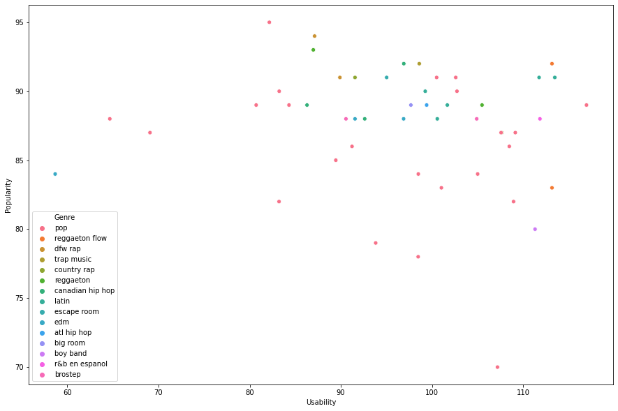

*This Jupyter notebook was created as a Jupyter notebook on my Kaggle profile. Click here [for the original Kaggle upload](https://www.kaggle.com/khushipathak/spotify-top-50-2019)*

Author: Khushi Pathak


```python
# This Python 3 environment comes with many helpful analytics libraries installed
# It is defined by the kaggle/python Docker image: https://github.com/kaggle/docker-python
# For example, here's several helpful packages to load

import numpy as np # linear algebra
import pandas as pd # data processing, CSV file I/O (e.g. pd.read_csv)
import seaborn as sns
import matplotlib.pyplot as plt
import re 

# Input data files are available in the read-only "../input/" directory
# For example, running this (by clicking run or pressing Shift+Enter) will list all files under the input directory

import os
for dirname, _, filenames in os.walk('/kaggle/input'):
    for filename in filenames:
        print(os.path.join(dirname, filename))

# You can write up to 5GB to the current directory (/kaggle/working/) that gets preserved as output when you create a version using "Save & Run All" 
# You can also write temporary files to /kaggle/temp/, but they won't be saved outside of the current session
```

    /kaggle/input/top50spotify2019/top50.csv


# I love Spotify.

The Top 50 playlist is one I visit often when I need to find new music. About half the time, I end up liking a song from the playlist a lot, otherwise I simply detest it. Now, my music taste varies between alt-pop and I generally prefer songs that I can sing easily. But does the whole world share the same views as me, or am I just an outlier? 

Let's check out this dataset to find out further.


```python
data = pd.read_csv("../input/top50spotify2019/top50.csv",encoding='ISO-8859-1')
data.head()
```


<div>
<style scoped>
    .dataframe tbody tr th:only-of-type {
        vertical-align: middle;
    }

    .dataframe tbody tr th {
        vertical-align: top;
    }

    .dataframe thead th {
        text-align: right;
    }
</style>
<table border="1" class="dataframe">
  <thead>
    <tr style="text-align: right;">
      <th></th>
      <th>Unnamed: 0</th>
      <th>Track.Name</th>
      <th>Artist.Name</th>
      <th>Genre</th>
      <th>Beats.Per.Minute</th>
      <th>Energy</th>
      <th>Danceability</th>
      <th>Loudness..dB..</th>
      <th>Liveness</th>
      <th>Valence.</th>
      <th>Length.</th>
      <th>Acousticness..</th>
      <th>Speechiness.</th>
      <th>Popularity</th>
    </tr>
  </thead>
  <tbody>
    <tr>
      <th>0</th>
      <td>1</td>
      <td>Señorita</td>
      <td>Shawn Mendes</td>
      <td>canadian pop</td>
      <td>117</td>
      <td>55</td>
      <td>76</td>
      <td>-6</td>
      <td>8</td>
      <td>75</td>
      <td>191</td>
      <td>4</td>
      <td>3</td>
      <td>79</td>
    </tr>
    <tr>
      <th>1</th>
      <td>2</td>
      <td>China</td>
      <td>Anuel AA</td>
      <td>reggaeton flow</td>
      <td>105</td>
      <td>81</td>
      <td>79</td>
      <td>-4</td>
      <td>8</td>
      <td>61</td>
      <td>302</td>
      <td>8</td>
      <td>9</td>
      <td>92</td>
    </tr>
    <tr>
      <th>2</th>
      <td>3</td>
      <td>boyfriend (with Social House)</td>
      <td>Ariana Grande</td>
      <td>dance pop</td>
      <td>190</td>
      <td>80</td>
      <td>40</td>
      <td>-4</td>
      <td>16</td>
      <td>70</td>
      <td>186</td>
      <td>12</td>
      <td>46</td>
      <td>85</td>
    </tr>
    <tr>
      <th>3</th>
      <td>4</td>
      <td>Beautiful People (feat. Khalid)</td>
      <td>Ed Sheeran</td>
      <td>pop</td>
      <td>93</td>
      <td>65</td>
      <td>64</td>
      <td>-8</td>
      <td>8</td>
      <td>55</td>
      <td>198</td>
      <td>12</td>
      <td>19</td>
      <td>86</td>
    </tr>
    <tr>
      <th>4</th>
      <td>5</td>
      <td>Goodbyes (Feat. Young Thug)</td>
      <td>Post Malone</td>
      <td>dfw rap</td>
      <td>150</td>
      <td>65</td>
      <td>58</td>
      <td>-4</td>
      <td>11</td>
      <td>18</td>
      <td>175</td>
      <td>45</td>
      <td>7</td>
      <td>94</td>
    </tr>
  </tbody>
</table>
</div>


### Features

* **Danceability** = Danceability describes how suitable a track is for dancing based on a combination of musical elements including tempo, rhythm stability, beat strength, and overall regularity.
* **Energy** = Typically, energetic tracks feel fast, loud, and noisy. For example, death metal has high energy, while a Bach prelude scores low on the scale. Perceptual features contributing to this attribute include dynamic range, perceived loudness, timbre, onset rate, and general entropy.
* **Liveness** = Detects the presence of an audience in the recording. Higher liveness values represent an increased probability that the track was performed live.
* **Loudness** = The overall loudness of a track in decibels (dB). Loudness values are averaged across the entire track and are useful for comparing relative loudness of tracks. Loudness is the quality of a sound that is the primary psychological correlate of physical strength (amplitude).
* **Speechiness** = Detects the presence of spoken words in a track.

Let's rename the columns for better readablity and delete the unnecessary "Unnamed: 0" column as well as the ones that we will not be analysing:


```python
data.rename(columns={"Loudness..dB..":"Loudness",
                     "Speechiness.":"Speechiness",
                     "Track.Name":"Track",
                     "Artist.Name":"Artist"},inplace=True)
data.drop(["Unnamed: 0",
          "Valence.", 
          "Acousticness..",
          "Beats.Per.Minute", 
          "Length."], axis=1,inplace=True)

data.head()
```


<div>
<style scoped>
    .dataframe tbody tr th:only-of-type {
        vertical-align: middle;
    }

    .dataframe tbody tr th {
        vertical-align: top;
    }

    .dataframe thead th {
        text-align: right;
    }
</style>
<table border="1" class="dataframe">
  <thead>
    <tr style="text-align: right;">
      <th></th>
      <th>Track</th>
      <th>Artist</th>
      <th>Genre</th>
      <th>Energy</th>
      <th>Danceability</th>
      <th>Loudness</th>
      <th>Liveness</th>
      <th>Speechiness</th>
      <th>Popularity</th>
    </tr>
  </thead>
  <tbody>
    <tr>
      <th>0</th>
      <td>Señorita</td>
      <td>Shawn Mendes</td>
      <td>canadian pop</td>
      <td>55</td>
      <td>76</td>
      <td>-6</td>
      <td>8</td>
      <td>3</td>
      <td>79</td>
    </tr>
    <tr>
      <th>1</th>
      <td>China</td>
      <td>Anuel AA</td>
      <td>reggaeton flow</td>
      <td>81</td>
      <td>79</td>
      <td>-4</td>
      <td>8</td>
      <td>9</td>
      <td>92</td>
    </tr>
    <tr>
      <th>2</th>
      <td>boyfriend (with Social House)</td>
      <td>Ariana Grande</td>
      <td>dance pop</td>
      <td>80</td>
      <td>40</td>
      <td>-4</td>
      <td>16</td>
      <td>46</td>
      <td>85</td>
    </tr>
    <tr>
      <th>3</th>
      <td>Beautiful People (feat. Khalid)</td>
      <td>Ed Sheeran</td>
      <td>pop</td>
      <td>65</td>
      <td>64</td>
      <td>-8</td>
      <td>8</td>
      <td>19</td>
      <td>86</td>
    </tr>
    <tr>
      <th>4</th>
      <td>Goodbyes (Feat. Young Thug)</td>
      <td>Post Malone</td>
      <td>dfw rap</td>
      <td>65</td>
      <td>58</td>
      <td>-4</td>
      <td>11</td>
      <td>7</td>
      <td>94</td>
    </tr>
  </tbody>
</table>
</div>


Low energy songs like Senorita may also have a higher danceablity factor, while catchy songs like Ariana's 'boyfriend' may have high energy and low danceablity. We shall combine these two attributes into a feature called **"Usability"**, i.e. is someone likely to sing or dance to  this song.


```python
data['Usability'] = np.sqrt((data['Energy'])**2 + (data['Danceability'])**2)
data.drop(["Energy", "Danceability"], axis=1,inplace=True)
data.head()
```


<div>
<style scoped>
    .dataframe tbody tr th:only-of-type {
        vertical-align: middle;
    }

    .dataframe tbody tr th {
        vertical-align: top;
    }

    .dataframe thead th {
        text-align: right;
    }
</style>
<table border="1" class="dataframe">
  <thead>
    <tr style="text-align: right;">
      <th></th>
      <th>Track</th>
      <th>Artist</th>
      <th>Genre</th>
      <th>Loudness</th>
      <th>Liveness</th>
      <th>Speechiness</th>
      <th>Popularity</th>
      <th>Usability</th>
    </tr>
  </thead>
  <tbody>
    <tr>
      <th>0</th>
      <td>Señorita</td>
      <td>Shawn Mendes</td>
      <td>canadian pop</td>
      <td>-6</td>
      <td>8</td>
      <td>3</td>
      <td>79</td>
      <td>93.813645</td>
    </tr>
    <tr>
      <th>1</th>
      <td>China</td>
      <td>Anuel AA</td>
      <td>reggaeton flow</td>
      <td>-4</td>
      <td>8</td>
      <td>9</td>
      <td>92</td>
      <td>113.145923</td>
    </tr>
    <tr>
      <th>2</th>
      <td>boyfriend (with Social House)</td>
      <td>Ariana Grande</td>
      <td>dance pop</td>
      <td>-4</td>
      <td>16</td>
      <td>46</td>
      <td>85</td>
      <td>89.442719</td>
    </tr>
    <tr>
      <th>3</th>
      <td>Beautiful People (feat. Khalid)</td>
      <td>Ed Sheeran</td>
      <td>pop</td>
      <td>-8</td>
      <td>8</td>
      <td>19</td>
      <td>86</td>
      <td>91.219515</td>
    </tr>
    <tr>
      <th>4</th>
      <td>Goodbyes (Feat. Young Thug)</td>
      <td>Post Malone</td>
      <td>dfw rap</td>
      <td>-4</td>
      <td>11</td>
      <td>7</td>
      <td>94</td>
      <td>87.114867</td>
    </tr>
  </tbody>
</table>
</div>


A lot of these genres are variations of the 'pop' genre. It would be easier to just club them all together into one genre called 'pop'


```python
datacopy = data

for genre in data['Genre']:
    if re.search('pop', genre):
        data.loc[data.Genre == genre, 'Genre'] = 'pop'
        
data.head()
```


<div>
<style scoped>
    .dataframe tbody tr th:only-of-type {
        vertical-align: middle;
    }

    .dataframe tbody tr th {
        vertical-align: top;
    }

    .dataframe thead th {
        text-align: right;
    }
</style>
<table border="1" class="dataframe">
  <thead>
    <tr style="text-align: right;">
      <th></th>
      <th>Track</th>
      <th>Artist</th>
      <th>Genre</th>
      <th>Loudness</th>
      <th>Liveness</th>
      <th>Speechiness</th>
      <th>Popularity</th>
      <th>Usability</th>
    </tr>
  </thead>
  <tbody>
    <tr>
      <th>0</th>
      <td>Señorita</td>
      <td>Shawn Mendes</td>
      <td>pop</td>
      <td>-6</td>
      <td>8</td>
      <td>3</td>
      <td>79</td>
      <td>93.813645</td>
    </tr>
    <tr>
      <th>1</th>
      <td>China</td>
      <td>Anuel AA</td>
      <td>reggaeton flow</td>
      <td>-4</td>
      <td>8</td>
      <td>9</td>
      <td>92</td>
      <td>113.145923</td>
    </tr>
    <tr>
      <th>2</th>
      <td>boyfriend (with Social House)</td>
      <td>Ariana Grande</td>
      <td>pop</td>
      <td>-4</td>
      <td>16</td>
      <td>46</td>
      <td>85</td>
      <td>89.442719</td>
    </tr>
    <tr>
      <th>3</th>
      <td>Beautiful People (feat. Khalid)</td>
      <td>Ed Sheeran</td>
      <td>pop</td>
      <td>-8</td>
      <td>8</td>
      <td>19</td>
      <td>86</td>
      <td>91.219515</td>
    </tr>
    <tr>
      <th>4</th>
      <td>Goodbyes (Feat. Young Thug)</td>
      <td>Post Malone</td>
      <td>dfw rap</td>
      <td>-4</td>
      <td>11</td>
      <td>7</td>
      <td>94</td>
      <td>87.114867</td>
    </tr>
  </tbody>
</table>
</div>


```python
plt.figure(figsize=(15,10))
sns.scatterplot(y = "Popularity", x = 'Usability',
                hue = "Genre", data = data);
```





From the above graph, we can make out that while pop songs are popular regardless of how usable they are, the other genres often have to step up on their usability points to become more popular. A low energy EDM song which you can't dance to is unlikely to be popular enough for Spotify's Top 50. Perhaps you can find it in "Relaxing Studying Music" playlists instead?

Let's look at the graph for Speechiness vs Popularity for these pop songs


```python
plt.figure(figsize=(15,10))
mymodel = np.poly1d(np.polyfit(x = data['Speechiness'], y = data["Popularity"], deg = 4))
myline = np.linspace(1, 50, 100)
plt.plot(myline, mymodel(myline))

sns.regplot(y = "Popularity", x = 'Speechiness', data = data.loc[data['Genre'] == 'pop'], fit_reg = True);
```


From the above graph it seems like low speechiness on pop songs does not affect their popularity (maybe when the song is more music and less lyrics). However, when the speechiness increases, the song popularity goes up (maybe because of easy to sing lyrics), and then falls down (maybe because excess lyrics mean less catchiness of the song).

## Conclusion


It seems like catchy pop songs that are easy to sing or fun to dance to will continue to dominate the Top 50 charts on Spotify. For other genres such as EDM, high energy or high danceability is a must if they wish to gain a spot on the top charts, while facing fierce competition form reggaetton songs, which are usually very high on danceability levels.

### If you liked this notebook, please leave an upvote and/or a comment! Thanks for reading!
